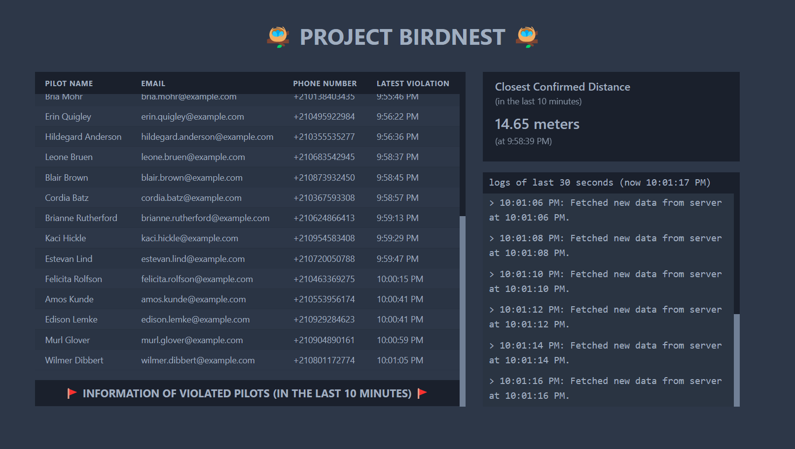

# BIRDNEST: Reaktor Pre-assignment for the Software Developer Traineeship - Summer 2023

---

This is the repository of the [Project Birdnest](https://hkhoa-ng.github.io/reaktor-pre-assignment-2023/) web application built for Reaktor's Software Developer Traineeship - Summer 2023.

## Tech Stack

- [Express.js](https://expressjs.com/) - Fast, unopinionated, minimalist web framework for Node.js. Used to build the server for the backend.
- [React.js](https://reactjs.org) - A JavaScript library for building user interfaces. Used to build the client frontend of the application.
- [Chakra UI](https://chakra-ui.com/) - Create accessible React apps with speed. In combination with [React.js](https://reactjs.org) to create the frontend.
- [Firebase](https://firebase.google.com/) - an app development platform that helps you build and grow apps and games users love. Used to build the database of the application.

The backend server is deployed on [Fly.io](https://fly.io/), while the frontend client is deployed on [GitHub Pages](https://pages.github.com/) using [gh-pages](https://www.npmjs.com/package/gh-pages).

---

## Project Structure

```
$PROJECT_ROOT
│   # Client files
├── client/src
    │   # Component files
    ├── components
│   # Server files
├── server
    │   # Firebase database
    ├── firebaseDB
    │   # Utility files for the server
    ├── utils
│   # Documentation
├── docs
```

---

## About the Implementation

The implementation of the application consists of 2 main parts: the [server](./server) for the backend and the [client](./client) for the frontend. The [database](./server/firebaseDB/Firebase.js) is implemented using [Firebase Realtime Database](https://firebase.google.com/docs/database/web/start). The server does the data fetching and processing from the provided Reaktor's API's, and updates the data to the database in realtime, every 2 seconds.
The client then requests the data from the server, and the server responses by getting the processed data from the database. That's how the application can **immediately displays the information** upon entering the [website](https://hkhoa-ng.github.io/reaktor-pre-assignment-2023/).



The UI of the application contains the title, a big scrollable table to display information of violated pilots, closest confirmed distance to the nest, and a console for showing the application's status (fetching data, error notification).

Note that I use [cors](https://www.npmjs.com/package/cors#simple-usage-enable-all-cors-requests) and [cors-anywhere](https://www.npmjs.com/package/cors-anywhere) to simplify the CORS policy of data fetching in the server, and from the Reaktor's API.

### Data fetching and processing

The server uses the JavaScript's [Fetch() API](https://developer.mozilla.org/en-US/docs/Web/API/Fetch_API) for fetching the data from Reaktor's API. It uses a [setInterval()](https://developer.mozilla.org/en-US/docs/Web/API/setInterval) method to **fetch data from the drones API every 2 seconds**, and process the `XML` response using [xml2json](https://www.npmjs.com/package/xml2json) parser. Based on the drones data, the server determines all the violated drones in each response snapshot, and **fetch the violated pilot information from the pilot API**, using the violated drones' `serialNumber`. The data fetching processes can be seen [here](./server/utils/fetchUtils.js).

The processed data is then updated to the database: writing the violated pilot's information, and confirmed distance of the violations with their timestamps. This is achieved using `writePilotData` and `writeClosestDistance` in [here](./server/firebaseDB/Firebase.js). The pilot data is stored in `JSON` objects in the `violatedPilots` database - with `pilot` being the data from the API, and `drone` being the violated drone of that `pilot`:

```
pilot.pilotId: {
    fullname: pilot.firstName + pilot.lastName,
    email: pilot.email,
    phoneNum: pilot.phoneNumber,
    timestamp: drone.timestamp,
  }
```

And the confirmed distance of each violation is stored in the `distances` database - also as a `JSON` object - with the key being the primitive value (using JavaScript's [valueOf()](https://developer.mozilla.org/en-US/docs/Web/JavaScript/Reference/Global_Objects/Date/valueOf) function) of the violation's timestamp, so that only the closest distance of each violation is being recored:

```
violation.timestamp.valueOf(): {
  distance: violation.distance
}
```

With these 2 databases, we can keep track of the information of **violated pilots** and **closest confirmed distance** within **the last 10 minutes**. The server automatically updates these databases every 2 seconds. It also filters the old entries (those with `timestamp` > 10 minutes from now) from the databases using `filterTenMinutes` in [here](./server/utils/dataUtils.js), so that the database only need to keep track of the latest violations.

### Running the backend server 24/7

The backend server was deployed to [fly.io](https://fly.io) to be always operational, at [this endpoint](https://khoa-ng-birdnest-backend.fly.dev/api) so that the frontend client can immediately fetch data from it upon entering. Due to the limited memory restriction from the free plan that I'm using, the server will run out of memory (since we have so many `Promise()` running asynchronously) once every couple of minutes, and is forced to be restarted. If that were to happened, the frontend's console should display:

```
`Error while trying to fetch data from the backend server: TypeError: Failed to fetch.`
```

With that said, the server is fully operational, and theoretically could run without any issues when it is more optimized and has enough memory.
For that reason, I made 2 additional endpoints for the backend server, aside from the main `/api` to fetch the data: `/stop` and `/resume` to, well, stop and resume the data fetching and processing of the server. A `GET` HTTPS request can be made to `https://khoa-ng-birdnest-backend.fly.dev/stop` to pause the data fetching process, and vice versa, a similar request can be made to `https://khoa-ng-birdnest-backend.fly.dev/resume` to resume it.

### Performance

For now, the application performs fine without any interuption for short sessions (15-20 minutes). From my observation, the server's memory often runs out after 15 minutes, so every 15 minutes, we have to wait for around 30 seconds for [fly.io](https://fly.io) to restart the server, and the application will be back and running again. Apart from that, the loading time of the data fetching from the server doesn't take too long, and is not noticeable.

---

## Limitations and Ideas for Improvement

The application is working properly, but there are plenty room for improvements in future iterations.

### Known Bugs and Problems

List of known bugs and problems in the app:

- Didn't properly configure CORS usage. Reliance on [cors](https://www.npmjs.com/package/cors#simple-usage-enable-all-cors-requests) and [cors-anywhere](https://www.npmjs.com/package/cors-anywhere).
- Limited memory. Application get killed and restarted once every 15 minutes.
- Poor memory management in the backend from the use of many `Promise()` and multiple calls to the database.
- The frontend's code structure has many nested structures. Those can be devided into smaller components for easier maintainance.
- The database doesn't have data authentication and data filtering. For the sake of simplicity, I skipped this part.

### Improvement Ideas

The application can be improved in many aspects:

- Better CORS configuration in the backend, and when fetching data.
- Better memory management in the server's code, so that the cloud deployment doesn't run out of memory so frequently.
- Devide frontend code into smaller component.
- Implement data filtering before writing to database.
- Improve error handling.
- Write tests.

---

## What have I learned?

Though this assignment, I learned how to plan, build, and deploy a fullstack web application. I really stepped outside of my comfort zone - frontend development - to tackle the unknown of different backend technology and the cloud. Without a doubt, I learned a lot.

In the beginning state of the project, before settling with [Express.js](https://expressjs.com/) for the backend, I couldn't even fetch the data from Reaktor's API properly because of the CORS policy. I tried using [Flask](https://flask.palletsprojects.com/en/2.2.x/), but couldn't connect it to my React frontend, so I dropped it and used Express instead. And it all worked out in the end!

With that said, I really appreciate the knowledge that I have now gathered, because they can really broaden the scope of projects I can develop now. I will keep learning and keep improving myself to be a professional software developer in the future!
